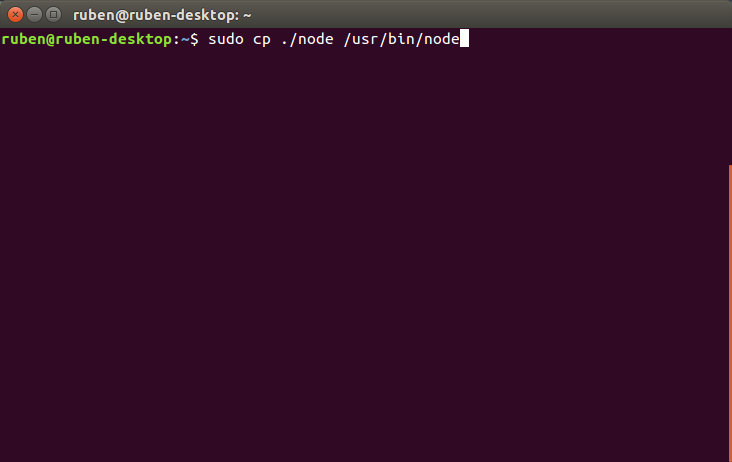

# Node.js

NodeJS es un entorno en tiempo de ejecución con arquitectura orientada a eventos que actúa del lado del servidor. Es de código abierto y está basado en el motor V8 de Google.

## Instalación de NodeJS en Ubuntu:
Para la instalación de NodeJS en ubunto existen dos métodos:
* Consola de comandos:

Este método es muy sencillo y rápido de realizar, pero en cambio instala una versión obsoleta de NodeJS.
* Descarga:

Para la descarga de NodeJS debemos dirigirnos a la página [**https://nodejs.org**](https://nodejs.org) y descargar una de las versiones existentes.

Al descomprimir el paquete descargado ya podemos hacer uso del node, aunque debemos dirigirnos a la carpeta /bin para poder ejecutarlo. Copiando el el archivo ejecutable Node a la carpeta **usr/bin** del sistema podemos hacer usuo del comando node desde cualquier parte del sistema.

Al instalar NodeJS se nos instala también el gestor de paquetes **NPM** (node package manager). Este gestor de paquetes nos permite instarlar software adicional para uso de NodeJS.
