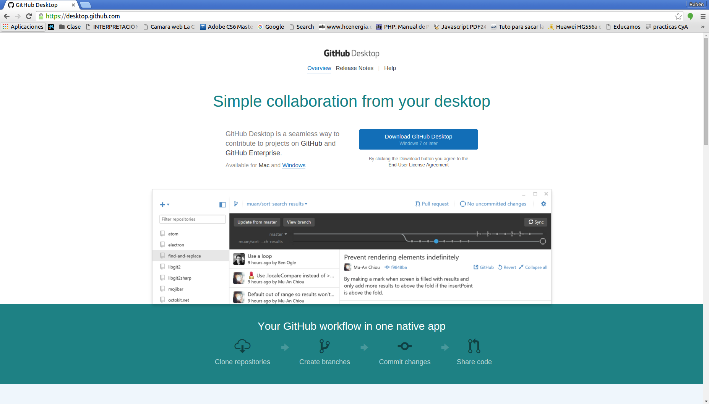

# Git/GitHub

## Git

GIT es un software de control de versiones diseñado por Linus Torvalds, pensando en la eficiencia y la confiabilidad del mantenimiento de versiones de aplicaciones cuando éstas tienen un gran número de archivos de código fuente. Al principio, Git se pensó como un motor de bajo nivel sobre el cual otros pudieran escribir la interfaz de usuario o front end. Sin embargo, Git se ha convertido desde entonces en un sistema de control de versiones con funcionalidad plena. Hay algunos proyectos de mucha relevancia que ya usan Git, en particular, el grupo de programación del núcleo Linux.

## GitHub

GitHub es una plataforma web que da soporte al desarrollo de software ofreciendo un sistema de repositorios online. Github hace uso del sistema de control de versiones **Git**. En Ubuntu se puede utilisar desde el terminal con los comandos del sistema Git.
Para Windows y MacOS existe un cliente gráfico que permite hacer uso de los servicios de GitHub.

