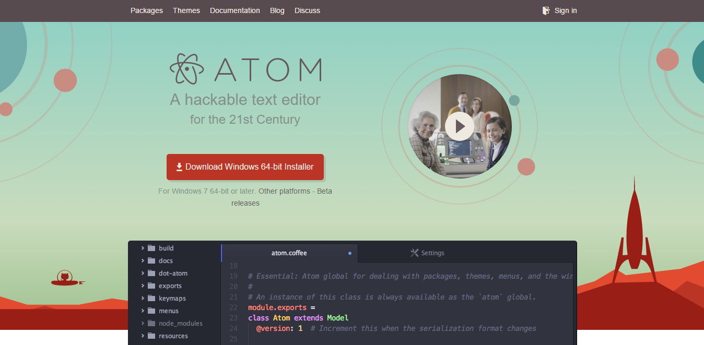
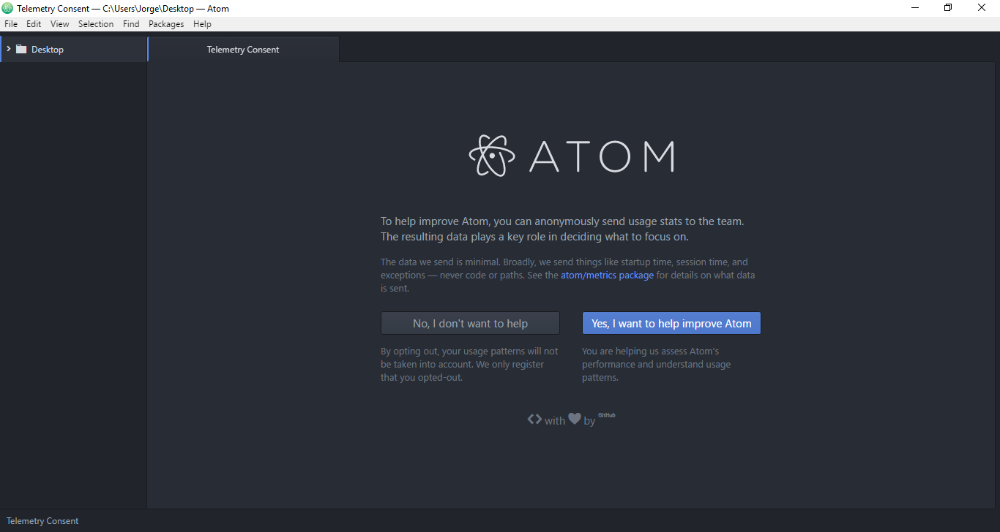

# Atom

Atom es un editor de código fuente para macOS, Linux y Windows con soporte para plug-ins escrito en Node.js, Incrustando el control de versiones Git y desarrollado por GitHub. Es una aplicación de escritorio construida utilizando tecnologías web.

## Instalación de Atom en Windows 10

Para instalar Atom debemos acceder a la [página principal de Atom](https://atom.io/) y descargar el instalador para windows

Una vez se haya descargado abrimos el ejecutable y comenzará la instalación automáticamente.

## Entorno de desarrollo de Atom

Una vez finalice la instalación automática se desplegará el entorno de desarrollo de Atom el cual es similar a este:

