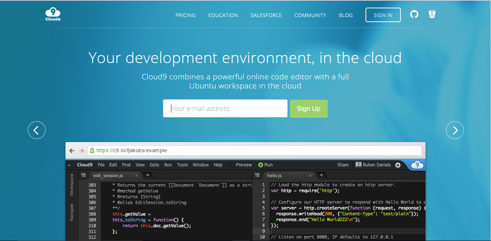
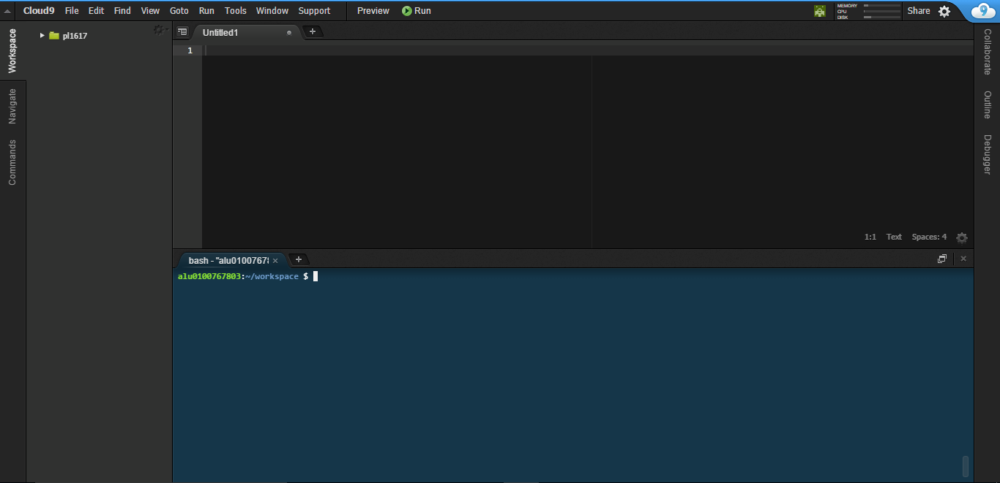

# Cloud 9

Cloud 9 es un entorno de desarrollo integrado en línea, publicado como código abierto desde la versión 3.0. Soporta cientos de lenguajes de programación incluyendo C, C++, Ruby, etc. 

Este entorno permite a los desarrolladores comenzar con la codificación de forma inmediata con espacios de trabajo preconfigurados, colaborar con sus compañeros con funciones de codificación colaborativa y características de desarrollo web coo la previsualización en vivo y las pruebas de compatibilidad con los navegadores.

## Registro en Cloud 9

Para registrarnos en Cloud 9 debemos acceder a la [página principal de Cloud 9](https://c9.io/)

Una vez estemos en esta página debemos introducir una dirección de correo electrónico y darle a **Sign Up** después de esto nos va a pedir diferentes datos como el nombre, nombre de usuario, etc. Debemos ir rellenando los campos y dandole a next.

También podemos acceder con una cuenta de GitHub o Bitbucket.

## Entorno de desarrollo de Cloud 9

Una vez nos hayamos registrados nos encontraremos con un entorno de desarrollo que nos va a proveer de las herramientas necesarias para desarrollar aplicaciones. EL entorno de desarrollo sería similar a este:

