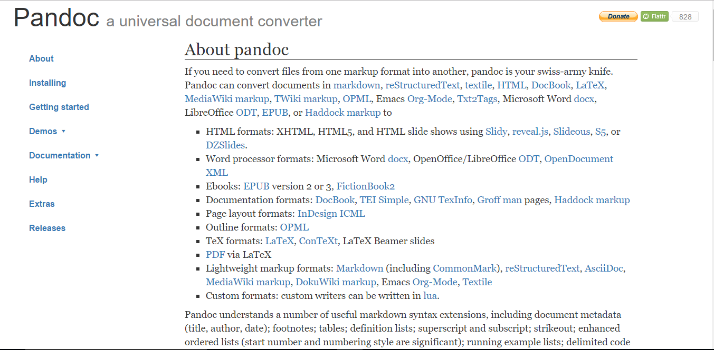
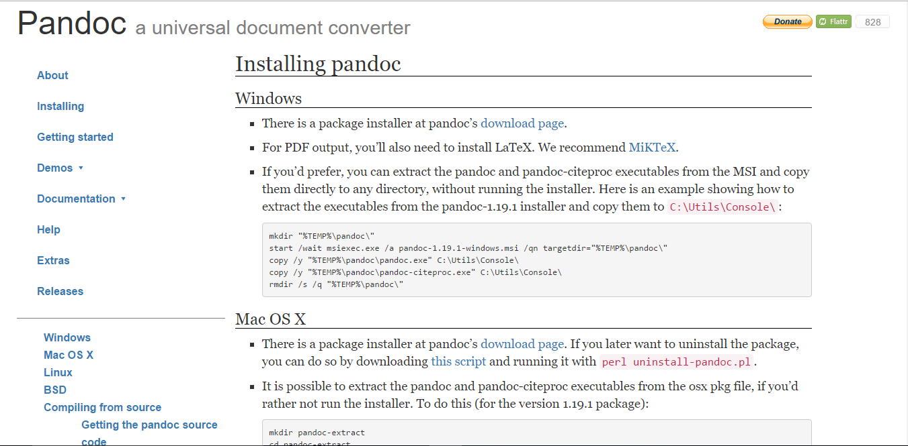
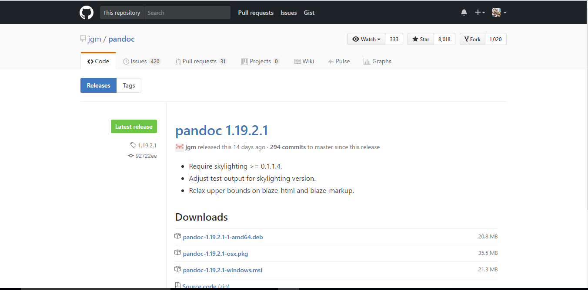
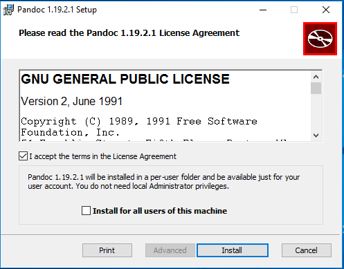
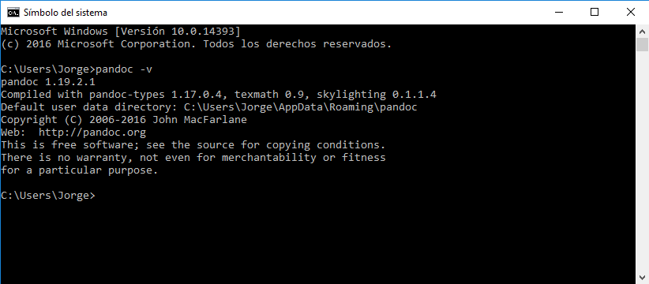

# Pandoc

Pandoc es un conversor de documentos libre y de código abierto, mayormente usado como una herramienta de escritura, y es una base para la publicación de flujos de trabajo.

## Instalación en Windows 10

Para instalar Pandoc debemos dirigirnos a la [página de Pandoc](http://pandoc.org/)

Una vez accedamos a la página de Pandoc debemos dirigirnos a [Installing](http://pandoc.org/installing.html)

y una vez que nos encontremos en esta ventana debemos acceder a la sección para windows y acceder al [download page](https://github.com/jgm/pandoc/releases/tag/1.19.2.1) lo que nos redirigirá a un repositorio en github desde el cual podremos descargarnos el installador de windows.

En el repositorio de pandoc seleccionaremos el instalador para windoes en nuestro caso es: **pandoc-1.19.2.1-windows.msi**.

Al abrir este instalador nos saldrá una ventana como la siguiente:

Dónde debemos aceptar los términos del contrato de licencia y decidir si queremos instalar Pandoc para todos los usuarios del ordenador. Una vez hecho esto le damos a Install y empezará el proceso de instalación de pandoc. 

Para comprobar si pandoc se ha instalado correctamente debemos acceder a la terminal de windows (Símbolo del sistema) y ejecutar el comando **pandoc -v** para ver la versión de pandoc instalada y debería salirnos un resultado similar a este 

## Uso de Pandoc

Pandoc nos permite convertir ficheros markdown en ficheros HTML, LaTeX y PDF entre otros. Para poder convertir estos ficheros debemos acceder a la terminal de windows de nuevo(Símbolo del sistema) y ejecutar alguno de los siguientes comandos:

* **De Markdown a HTML**

  Para realizar esta conversión se debe ejecutar el comando:

  ​		**pandoc test1.md -f markdown -t html -s -o test1.html**

  Donde el fichero test1.md es el fichero de origen en markdown y el fichero test1.html es el fichero resultante en HTML.

* **De Markdown a LaTeX**

  Para realizar esta conversión se debe ejecutar el comando:

  ​		**pandoc test1.md -f markdown -t latex -s -o test1.tex**

  Donde el fichero test1.md es el fichero de origen en markdown y el fichero test1.tex es el fichero resultante en LaTeX.

* **De Markdown a PDF**

  Para realizar esta conversion se debe ejecutar el comando:

  ​		**pandoc test1.md -s -o test1.pdf**

  DOnde el fichero test1.md es el fichero de origen en markdown y el fichero test1.pdf es el fichero resultante en PDF.